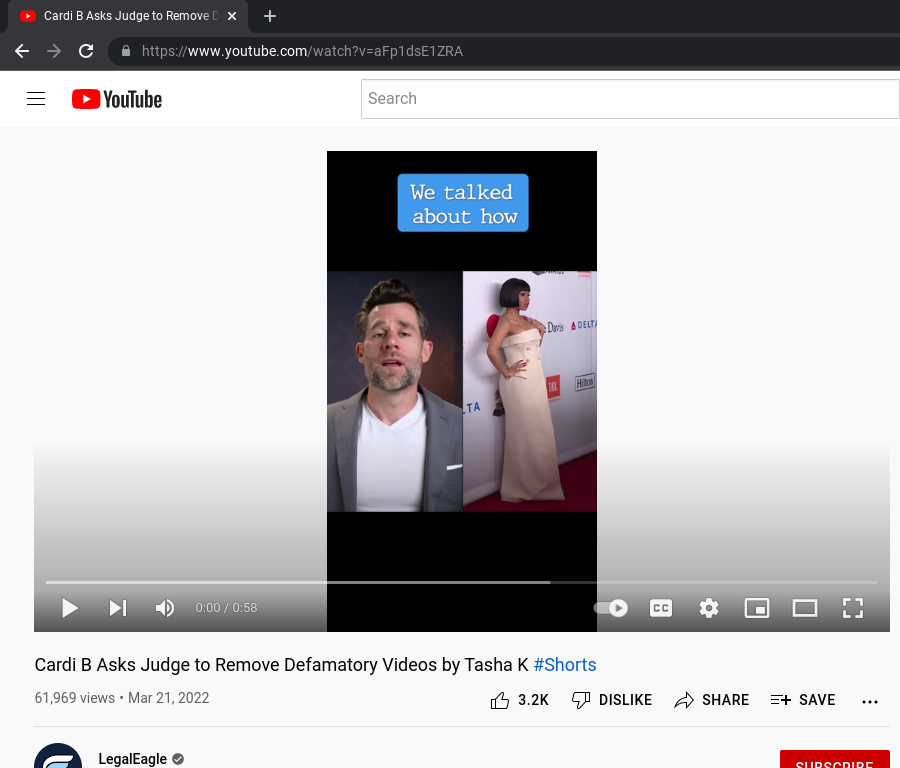

# Revert to the standard player interface for **Shorts** on youtube.com

Recently YouTube changed their player on desktop to more closely imitate the TikTok style video experience, like their mobile app does already. However, even videos published as Shorts can be viewed normally, by changing the URL:

`/shorts/<ID>` &rightarrow; `/watch?v=<ID>`

| Shorts | With `unshortsen` |
|---|---|
|||

---

## TODO:
1. Pop old URL from history, so there won't be a duplicate entry.